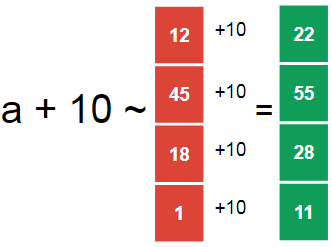
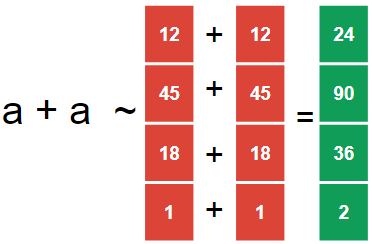
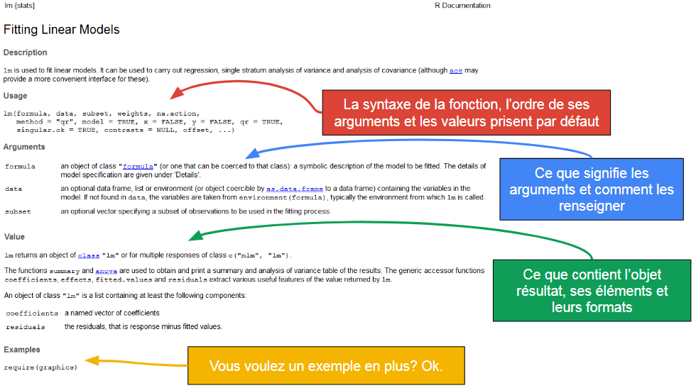

---
output:
  html_document:
    toc: true
    toc_float: true
---
<style>
  h1{
    font-size: 25px !important;
    color: #FFFFFF !important;
    border-style: solid;
    border-color: #4582EC;
    background-color: #4582EC;
    text-align: center;
  }
</style>

<style>
  h2{
    font-size: 25px !important;
    color: #4582EC !important;
    border-style: solid;
    border-color: #4582EC;
    text-align: center;
  }
</style>

<style>
  h3{
    font-size: 25px !important;
    color: #FFFFFF !important;
    border-style: solid;
    border-color: #982727;
    background-color: #982727;
    text-align: center;
  }
</style>

<style>
  h4{
    font-size: 25px !important;
    color: #FFFFFF !important;
    border-style: solid;
    border-color: #0F9D58;
    background-color: #0F9D58;
    text-align: center;
  }
</style>

<style>
  h5{
    font-size: 25px !important;
    color: #FFFFFF !important;
    border-style: solid;
    border-color: #F4B400;
    background-color: #F4B400;
    text-align: center;
  }
</style>

<h4>Synthèse</h4>

- Assigner un nom à des objets, avec l'opérateur '<-', permet de les conserver en mémoire et de les utiliser dans des calculs.    
- Un vecteur est un objet qui contient plusieurs éléments, il existe plusieurs type de vecteurs.   
- On peut sélectioner les éléments d'un vecteur en indiquant leur position entre crochets, après le nom du vecteur.    
- Une opération entre vecteur s'effectue entre chaques éléments du vecteur, un à un, si les vecteurs sont de même taille, si non le plus petit des vecteurs est recyclé: on ré-utilise ses valeurs à partir du 1er élément.   
- Les fonctions permettent de réaliser des actions pré-définies. Pour cela il faut remplir les paramètres obligatoires, et ne pas oublier que d'autres paramètres utilisent des valeurs par défaut non affichées.   
- Consulter l'aide des fonctions, et relire le code à la recherche d'éventuelles fautes de frappes, permet de résoudre la majorité des problèmes.

****

<h1>Fonctionnement de base</h1>

<h2>Calcul direct</h2>   

On peut utiliser R pour effectuer directement des calculs comme une calculatrice.   
Soit dans la zone de script (ctrl+enter pour valider) soit directement dans la console (enter).

```{r, eval=T}
1+15

15/4 + 12
```

Mais un des intérêt de R est de pouvoir réaliser des calculs sur de grands ensembles d'éléments ou de réaliser des ensembles de calculs complexes. Pour cela on manipule directement les objets qui contiennent les données en donnant les directives dans le script.

<h2>Assignement</h2>

R peut retenir en mémoire différents objets qui regroupent les données qu'on lui désigne (une valeur, le résultat d'un calcul, un ensemble d'opérations, ...). 

**Pour cela:**    
- on définit un identifiant (le nom qu'on utilisera pour rappeler l'objet)      
- on lui assigne l'objet souhaité à partir des symboles '<-'    

```{r, eval=FALSE}
X <- 2 #  On assigne à l'objet X, l'élément 2
X      #  l'objet X contient l'élément 2

X + X  #  on peut manipuler l'objet X pour effectuer des calculs directement

Y <- X + X #...ou assigner ce calcul à un autre objet (Y)
Y

Y + 15
```

Plusieurs éléments à remarquer:

```{r, eval=F}
Z <- 118 #  un objet assigné n'est pas directement exprime dans la console
Z        #  pour l'exprimer il faut l'appeler, c-a-d tapper le nom de l'objet (dans la console ou le script).

Z <- 22   #  si on assigne un nouvel élément à un objet déjà utilisé, on écrase la valeur precedente
Z        #  Z ne contient plus l'element 118 mais 22
```

<h1>Vecteurs de données</h1>
<h2>Créer un vecteur</h2>

Un des interet de R est de pouvoir réaliser des calculs sur de grand ensembles de données.  
Une façon de le faire est de les regrouper à l'interieur d'un objet.  

Pour cela:  
- on utilise la fonction 'concatenate' c()  
- on tappe les données que l'on souhaite regrouper, en les séparant par des virgules  


```{r, eval= F}
c(4,8)  #directement

X <- c(4, 8)  #par assignement
X
```

Ces objets sont appelés des vecteurs. 
Les vecteurs constituent un element important dans la logique de calcul de R.
Il existe plusieurs type de vecteur selon la nature des données qu'il contient.
Un vecteur ne contient toujours qu'un seul type de données.

Ils peuvent, par exemple, être numerique et ne contenir que des chiffres.     
Ils peuvent également contenir du texte ou des résultats d'opérateur logiques (TRUE / FALSE).

```{r, eval= FALSE}
X <- c("IMC normal", "IMC surpoids", "IMC surpoids") 
X

Y <- c(TRUE, FALSE, FALSE) 
Y
```

Les premiers pourront être utilisés, par exemple, pour créer des variables catégorielles.  
Les seconds sont des résultats d'opérations logiques.   
Ils pourront être utilisés pour définir si une condition est remplie pour l'execution calcul.


<h2>Manipuler un vecteur</h2>

Les vecteurs contiennent un ensemble de données.
On peut sélectionner à l'intérieur de ce vecteur une ou plusieurs données particulières en indiquant la position de l'élément.  

**Pour cela:**
- on utilisera "[]" juste apres le nom de notre vecteur
- on indique l'emplacement de l'élément inclus dans le vecteur

```{r}
a <- c(12,45,18,16,13,18,46)

a[5] # sélectione le 5eme élément du vecteur a
a[-5] # sélectionne tous les éléments SAUF le 5ème

a[c(1,4)] # sélectionne les éléments 1 et 4 du vecteur a
```

On peut également sélectionner des éléments du vecteur qui répondent à une condition logique. 

**Pour cela:**      
- on utilisera "[]" juste apres le nom de notre vecteur     
- on indique la condition que l'on veut remplir   

```{r}
a <- c(12,45,18,16,13,18,46)

a[a>20] # sélection, dans a, les éléments pour lesquels a est supérieur a 20

b <- a[a>20] # on peut créer un vecteur comprenant ce sous-ensemble
b # b est le sous-ensemble de a comprenant les éléments de a supérieurs à 20
a # a est inchangé et comprend toujours l'ensemble de ses éléments
```

<h2>Calculer à partir d'un vecteur</h2>

Rapidement on effectue donc des calculs sur un vecteur ou entre vecteur de données. 

Pour comprendre les opérations à partir des vecteurs il faut comprendre la répartition des calculs. 
De manière générale, R recherche à ajouter les éléments en fonction de leur position. 

L'addition est utilisée dans les exemple ci-après, les autres opérations fonctionnes également sur les mêmes régles.

Si on fait une addition entre un chiffre unique et un vecteur, ce chiffre s'ajoute à chaque élément sur chaque position du vecteur. 
On obtient donc un vecteur de la même taille que le vecteur initial, mais dont les valeurs ont été modifiées.

```{r}
a <- c(12, 45, 18, 1)
a + 10
```

{width=250px}
<br>

On peut ajouter deux vecteurs de taille égale.  On obtient un vecteur de la même taille que le vecteur initiale. Les éléments de même position dans les vecteurs se sont ajoutés. (La case 1 du vecteur 1 c'est ajoutée à la case 1 du vecteur 2, la case 2 ... à la case 2, etc...)


```{r}
a <- c(12, 45, 18, 1)
a + a
```

{width=250px}
<br>

On peut également ajouter deux vecteurs de tailles inégales. On obtient un vecteur de même taille que le vecteur initiale *le plus grand*.     
Les éléments s'ajoute un à un, selon leur position, jusqu'au moment où un des deux vecteurs n'a plus d'élément à proposer pour le calcul.  
Le vecteur le plus petit est alors *recyclé*, R réutilise les premières valeurs pour continuer l'opération, jusqu'à ce que le plus grand vecteur ait réalisé l'addition sur chacun de ses éléments. 


```{r}
a <- c(12, 45, 18, 1)
b <- c(1, 2, 3)
a + b
```

{width=320px}

On notera que R affiche un message d'alerte si les vecteurs sont de tailles inégales **et** que leur taille ne sont pas des multiples.

```{r}
v1 <- c(12, 45, 18, 1)
v2 <- c(1, 2, 3)
v3 <- c(1, 2)

v1 + v2
v1 + v3

# v1 + v2 + v3 - pouvez-vous prédire le vecteur de sortie sans lancer le calcul?
```

<br>

<h2>Valeurs manquantes</h2>

On peut représenter une valeur manquante dans un vecteur. On utilisera alors l'indicateur "NA". 
Une valeur manquante n'est pas considéré comme un 0, c'est une valeur non connue (Not Available), ce qu'il faut prendre en compte lors de la réalisation de calculs.

```{r}
a <- c(1,2,3, NA, 4)
a

a + 2

a[a>2]
```


<h1>Les fonctions</h1>
<h2> Utilisation générale</h2>

R inclue des fonctions dites de base.  
Elles permettent d'effectuer rapidement des ensembles de calculs ou d'actions pré-définis, en en contrôlant les paramètres


<br>
Chaque fonction comprend un ou plusieurs arguments, séparés par des virgules. Ce sont eux qui définissent les paramètres utilisés.    
<br>
Certains arguments sont a renseigner obligatoirement pour utiliser la fonction.  
D'autres ont une valeur par defaut, c'est celle qui sera utilisée si l'utilisateur ne la modifie pas. Attention ces dernières ne s'affichent pas! Consultez la page d'aide concernant la fonction pour voir l'ensemble de ses arguments.       
<br>

<h2> Syntaxe et lecture du code</h2>  

On notera que, dans la syntaxe d'une fonction, les arguments sont rangés dans un certain ordre. Si on se souvient de cet ordre cela permet de ne pas avoir à écrire le nom des argument dans la fonction.  
Si on renseigne le nom des arguments on n'est pas contraint de suivre l'ordre des arguments.

```{r, eval=F}
round(x = 15.23, digits = 1) # = arrondis le nombre 'argument x' à 'argument digits' nombre après la virgule
round(15.23, 1)

round(digits = 1, x = 15.23) # l'ordre peut être changé si on nomme les arguments
round(1, 15.23) # arguments non nommés, R considère qu'ils sont renseignés dans l'ordre
```

Les fonctions peuvent être utilisées à l'intérieur d'autres fonctions.  Cela permet d'enchaîner différentes actions successivement et de ne pas surcharger inutilement la mémoire. 

Quand plusieurs fonctions sont imbriquées, la lecture des actions se fait de l'intérieur vers l'extérieur.
<br>


<br><br>
**Ce code peut se lire:**   
1.  Définis un vecteur de 3 éléments: fonction c() (oui c'est une fonction)   
2.  Retire les données manquantes: fonction na.omit()     
3.  Fais la somme des éléments du vecteur: fonction sum()     
4.  Arrondis le résultat: fonction round() (l'argument par défaut est utilisé pour le nombre de chiffres après la virgule)     

On devinera que rapidement il est facile de se perdre dans la syntaxe. C'est également le cas lorsque les fonctions présentent de nombreux arguments. 

**Pour s'aider:**   
- Retour à la ligne pour mettre en évidence la structure du code et aérer le code. (Reformat Code:'ctrl+shift+A' ou Reindent Lines:'ctrl+i' sont vos amis).   
- Il y doit avoir autant de '(' ouvrantes que de ')' fermantes.   
- Les virgules sont généralement encadrées par des éléments ou sépare des arguments, sinon c'est probablement une faute de frappe.    

```{r, eval= F}
# codes identiques
# le premier isole les arguments
Model_lineaire <- lm( formula = ma_formule,
                      data = ma_base,
                      subset = condition_de_selection,
                      method = "qr",
                      singular.ok = TRUE,
                      contrasts = NULL )
# le second 
Model_lineaire <- lm( formula = ma_formule, data = ma_base, subset = condition_de_selection, method = "qr", singular.ok = TRUE, contrasts = NULL )
```

**Concernant l'enfer des parenthèses:**   
- Sur RStudio, quand on clique devant une parenthèse, la seconde parenthèse qui lui est associée est mise en surbrillance.   
- S'il manque une parenthèse dans un code lancé, un indicateur '+' apparait dans la console pour signaler qu'une action supplémentaire est requise. On peut utiliser la touche 'Echap' pour stopper le code et le corriger.   


<h2> Consulter la page d'aide</h2>

Pour consulter l'aide d'une fonction, tappez le nom de la fonction précédé d'un "?"
<br><br>

**On retrouve systématiquement plusieurs paragraphe:**  
- **'Usage'** qui décrit la syntaxe de la fonction, l'ordre des arguments et les valeurs prisent par défaut le cas échéant.  
- **'Arguments'** qui décrit les arguments, les données attendues pour les renseigner et le format que doivent avoir ces informations.   
- **'Value'** qui décrit la réponse que renvoi la fonction, les éléments qui composent la réponse et les différents formats de données.  
- **'Exemples'** donne un/des exemple(s) de l'utilisation de la fonction, souvent sur un cas courant.  
<br>

**Résultat après avoir tappé '?lm' dans la console**

<br><br>

<h2> Importer des fonctions</h2>

Les fonctions de bases sont nombreuses et permettent de réaliser un grand nombre d'actions.
Cependant on peu accéder à d'autres fonctions à partir des **packages**.
Les packages sont des ensembles de fonctions développées et mises à disposition en accès libre par les participants de la communauté R.
Chaque package répond généralement à une thématique/problématique particulière et contient des outils spécialisés pour y répondre.

Les packages sont disponibles sur le site [The Comprehensive R Archive Network - The CRAN](https://cran.r-project.org/).
Pour chaques package vous disposez du manuel d'utilisation qui recense l'ensemble des fonctions disponibles dans le package et parfois d'un tutoriel.

**Pour instaler directement un package depuis RStudio, il faut:**   
1. Télécharger le package (- une seule fois)    
2. Charger les fonctions du package (- a renouveller a chaque session).

```{r, eval=F}
Surv() #la fonction n'est pas disponible de base sur R

install.packages("survival") #telecharge et installe le package

library(survival) #active les fonctions pour la session en cours

Surv() #la fonction est disponible, mais les arguments ne sont pas renseignes

```

<h1> A l'aide!</h1>

Mon code ne fonctionne pas!  

**Des sources communes d'erreur:**    
    
1.    **Erreur de syntaxe**  
Vous avez fait une faute de frappe (~90% de vos futures erreurs).    
Vérifiez: le nom des vecteurs/fonctions, oublis majuscule/minuscule, oublis/rajouts de virgules, oublis/rajouts de parenthèses.    
Simplifiez votre code, particulièrement s'il est long: on écrit des phrases courtes et simples, on passe par des étapes intermédiaires.   
Allez prendre l'air 5 minutes / demandez à un collègue de relire rapidement votre code. Il est particulièrement difficile de repérer ce type d'erreur quand on est fatigué. Inversement, il est relativement simple de voir les fautes de frappes que font les autres. 

2.  **Mauvaise utilisation des fonctions**    
*La fonction fait elle vraiment ce que vous voulez?*    
Regardez sa description dans l'aide.  
<br>
*Vous avez bien renseigné ses paramètres?*    
Regardez dans l'aide les arguments que vous devez **obligatoirement** renseigner, regardez le format que doivent avoir ces paramètres (texte, nombre unique, vecteur, matrice?) que vous entrez en tant qu'arguments, vérifiez que le(s) résultat(s) des fonctions ont le format que vous pensez si vous les utilisez comme arguments dans d'autres fonctions. Regarder l'exemple disponible dans l'aide, dans des tutoriels, sur les [forums](https://stats.stackexchange.com/) permet de voir l'utilisation de la fonction et souvent de la transposer dans son propre code avec un peu d'adaptation.  
<br>
*Que vous dis le message d'erreur dans la console?*   
Il désigne souvent l'élément fautif. Copier/coller ce message d'erreur sur google vous permet souvent de tomber sur le message desespéré de quelqu'un qui a également rencontré ce problème. Généralement, quelqu'un y a apporté une réponse.  
<br>
*Comment la fonction gère t'elle les données manquantes?*   
Toutes les fonctions n'ont pas la même politique face aux données manquantes. Vérifiez s'il y a des données manquantes dans vos vecteurs, vérifiez dans l'aide comment la fonction les gère.


3.  **En réalité vous êtes perdu**    
Faîtes un plan générale de votre code.       
<br>
*Vous savez d'où vous partez et où vous voulez aller?*    
**Non?**    
Prenez le temps d'y réfléchir avant de chercher à coder quelque chose.          
**Oui?**  
Définissez clairement, sur un papier, d'où vous partez (quel type de données, quel format, quelle taille), le résultat que vous voulez atteindre (idem).     
Ecrivez synthétiquement, en français, les étapes que vous imaginez entre ces deux points.       
Traduisez les verbes d'actions en fonction R. Si vous ne connaissez pas encore de fonction qui réalise cette action, demandez à google. En traduisant progressivement les instructions en français en code R vous réglerez la plupart des situations les plus simples.    
Si votre problème persiste, postez votre plan et votre code sur un [forum d'aide](https://stats.stackexchange.com/). 

Un exemple:

```{r}
# j'ai le poids de plusieurs personnes
# je veux calculer le poids moyen

# Point de départ:
# c'est un vecteur, de plusieurs éléments, je me doute qu'il contient des données manquantes

poids <- c(61, 62, 63, 64, 65, NA, 67)

# Point d'arrivé:
# je veux le poids moyen, c'est un vecteur qui contiendra un seul élément

## les étapes:

# Je dois calculer la somme des poids
# Google: 'summing elements of a vector in r'
# 1ère réponse: fonction sum()
# je consulte l'aide: ?sum()

# Je dois prévoir la présence de données manquantes
# Google: 'remove na in r'
# 1ère réponse: fonction na.omit()

poids_sans_NA <- na.omit(poids)

la_somme <- sum( poids_sans_NA)

# Je dois calculer le nombre d'éléments dans le vecteur
# Google: 'length of vector r'
# 1ère réponse: fonction length()
# je consulte l'aide: ?length()

taille <- length( poids_sans_NA)

# J'arrive à mon étape finale

Poids_moyen <- la_somme / taille
Poids_moyen

# Mais mon plan comporte des étapes inutiles,
# j'aurai pu le résumer par: calculer la moyenne d'un vecteur avec des données manquantes
# Google: 'calculate mean with na in r'
# 1ère réponse: fonction mean() avec argument na.rm= TRUE

Poids_moyen2 <- mean(poids, na.rm = TRUE)
Poids_moyen2
```

<h5>Fonctions sur cette page</h5>

| Fonction             | Description     |
|----------------------|---------------------------------------------------|
| c() | crée un vecteur contenant les éléments renseignés comme arguments |
| round(x = , digits = ) | arrondis l'objet 'x' à 'digits' valeurs après la virgule |
| lm(data = , formula = ) | définis le modèle linéaire de formule 'formula', sur les données 'data |
| na.omit() | retire les données NA de l'objet en argument |
| sum() | calcul la somme des éléments du vecteur en argument |
| length() | calcul le nombre d'lééments contenu dans le vecteur en argument |
| mean(x = , na.rm = ) | calcul la moyenne du vecteur 'x', en prenant en compte la présence de NA  |

<h3>Pour s'entraîner</h3>

Des exercices sont proposés ICI.