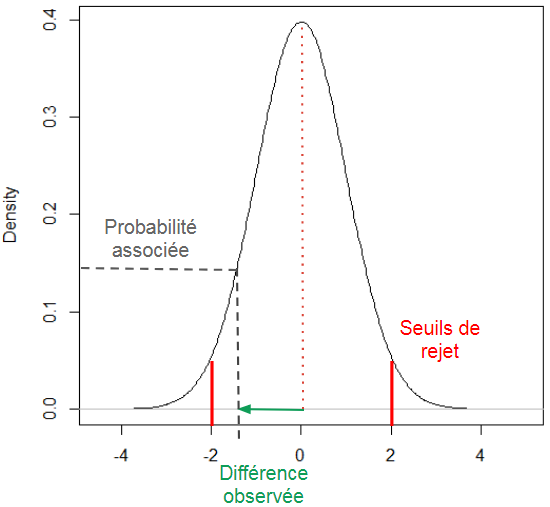

---
output:
  html_document:
    toc: true
    toc_float: true
---
<style>
  h1{
    font-size: 25px !important;
    color: #FFFFFF !important;
    border-style: solid;
    border-color: #4582EC;
    background-color: #4582EC;
    text-align: center;
  }
</style>

<style>
  h2{
    font-size: 25px !important;
    color: #4582EC !important;
    border-style: solid;
    border-color: #4582EC;
    text-align: center;
  }
</style>

<style>
  h3{
    font-size: 25px !important;
    color: #FFFFFF !important;
    border-style: solid;
    border-color: #982727;
    background-color: #982727;
    text-align: center;
  }
</style>
<style>
  h4{
    font-size: 25px !important;
    color: #FFFFFF !important;
    border-style: solid;
    border-color: #0F9D58;
    background-color: #0F9D58;
    text-align: center;
  }
</style>

<style>
  h5{
    font-size: 25px !important;
    color: #FFFFFF !important;
    border-style: solid;
    border-color: #F4B400;
    background-color: #F4B400;
    text-align: center;
  }
</style>

<h4>Synthèse</h4>

- Il faut ~ 1 ligne de code pour lancer un test, ~ 3 lignes dans la console pour en comprendre les résultats et ~50 lignes de texte pour expliquer vaguement leur fonctionnement.   

- On peut comparer les moyennes entre deux groupes, sous certaines conditions, à partir d'un test de student: t.test(). (Pour la comparaison de plus de 2 groupes on utilisera un modèle linéaire.) 
- On peut comparer les pourcentages entre deux groupes ou plus, sous certaines conditions, à partir d'un test du chi²: chisq.test().

<h1>Comparaison de moyennes</h1>
<h2>Principe du test</h2>

On souhaite comparer les valeur prisent par une variable continue, dans 2 populations différentes d'individus.  

Pour cela on a constitué 2 groupes, en sélectionant des personnes dans nos deux populations d'intérêt.   
Ces 2 groupes sont des échantillons d'une population plus vaste que l'on aimerait mieux comprendre. 
On va comparer les 2 échantillons, et extrapoler nos résultats aux populations.    

On commence par déterminer la tendance centrale prise par la variable dans chaque échantillon. Ce sont ces statistiques que l'on comparera entre les deux groupes (le plus souvent la moyenne).

**Mais quand on compare les moyennes des deux groupes, on a du mal à savoir si la différence que l'on observe:**   
**(1)** existe parce que nos populations sources ont réellement des valeurs moyennes différentes pour cette variable   
**(2)** existe à cause du processus d'échantillonnage: en créant nos échantillons, on a constitué par hasard un groupe avec des valeurs plus haute que l'autre alors qu'en fait leur population sources ont des valeurs moyennes identiques.    


<br><br>
Si on s'inscrit dans la démarche des tests d'hypothèses, c'est cette dernière hypothèse que l'on va tester. 
Elle constituera l'**hypothèse nulle**: la différence que j'observe est lié à l'échantillonage, mes populations ont des moyennes identiques pour cette variable.

**Cette hypothèse suppose que:**  
**(1)** Si on avait recommencé l'expérimentation à l'identique, en reconstituant 2 groupes de la même façon et en comparant leur moyenne, **la différence entre les moyennes aurait été différente**.  
**(2)** Si on l'avait fait un grand nombre de fois, parfois cette différence aurait été dans un sens, parfois dans l'autre, parfois grande, parfois petite. 

*C'est ce que l'on observe sur la figure suivante. Si on crée 2 groupes en tirant au sort des individus issus d'une même population, on observe des différences de moyenne entre les deux groupes. Ces différences de moyennes changent à chaque fois que l'on crée de nouveaux échantillons, pourtant les caractéristisques de la population source n'ont pas changées.*


**(3)** Au final, en répétant l'opération, on n'aurait pas observé une différence en faveur d'un groupe plutôt qu'un autre. **La moyenne des différences aurait été très proche de 0**.  

*C'est ce que l'on observe sur l'histogramme suivant. On a constitué 2 groupes en tirant au sort des individus issus d'une même population source. On a comparé les moyennes dans ces deux groupes. On a répété ce processus 3000 fois, en conservant à chaque fois les différences entre moyenne que l'on observe. Si on regarde ces différences de moyenne, on constate qu'elles sont le plus souvent proche de 0.*


Le problème c'est que, souvent, on ne peut pas facilement répéter l'expérimentation un très grand nombre de fois pour voir si la différence de moyenne fait bien en moyenne 0 (ou non) entre nos deux groupes.          

Cependant, sous certaines conditions, on a une idée de la distribution que suit la différence des moyennes **si l'hypothèse nulle était la bonne**.  

Dis autrement, dans certaines conditions, j'arrive à quantifier le fait que: "*si on avait répété l'expérimentation et que l'hypothèse nulle était la bonne,* on aurait très souvent observé une différence quasi nulle entre les moyennes des échantillons, souvent des différences faibles, très rarement des différences importantes et pratiquement jamais de très grosses différences".  

En utilisant cette distribution théorique, on peut évaluer numériquement la probabilité d'observer une différence aussi grande que celle que l'on a mesuré dans nos échantillons, **si l'hypothèse nulle était la bonne**: c'est la p-value.   

Pour cela on calcule une statistique: la distance qui sépare la différence que l'on a observé entre les moyennes (en prenant également en compte la variance et la taille des échantillons) et la valeur 0. Plus cette distance est grande (en valeur absolue), plus la différence que l'on observe est éloignée de 0: la probabilité d'observer une telle différence diminue.

Plus cette probabilité diminue, plus on a du mal à croire que l'on puisse observer cette différence entre nos moyennes alors qu'en réalité l'hypothèse nulle était la bonne.


<br><br>
Généralement, on définit au préalable un seuil de rejet à partir duquel on décidera d'abandonner l'hypothèse nulle. <br>
Si ma p-value dépasse ce seuil, je conviens de conclure au rejet de l'hypothèse nulle. 

Ce seuil correspond au **risque $\alpha$**, le risque que je rejette à tord l'hypothèse nulle: j'ai tiré au sort des échantillons qui présentaient aléatoirement une forte différence de moyenne, j'ai trouvé cela trop surprenant pour considérer que l'hypothèse nulle soit vrai, je l'ai rejeté, pourtant c'était le cas, je m'en veux.    

On définit également le **risque $\beta$**, le risque de ne pas parvenir à rejeter l'hypothèse nulle: j'ai tiré au sort des échantillons qui présentaient une différence modérée entre leur moyenne, j'ai cru que l'hypothèse nulle était possible, en réalité elle est fausse.

**Cependant on n'oubliera pas plusieurs choses:**      
**(1)** Si on ne rejette pas l'hypothèse nulle, ça ne veut pas pour autant dire qu'elle est vrai. Avait-on vraiment les données sufisantes pour le faire?      
**(2)** Si on rejette l'hypothèse nulle, on ne pas être sûr d'avoir commis une erreur lié au risque $\alpha$.  
**(3)** Si on rejette l'hypothèse nulle, ça ne veut pas pour autant dire que la différence entre les moyennes est importante. Avec des effectifs nombreux on peut mettre en évidence de très faibles différences qui ne présentent aucuns intérêt cliniques.     
**(4)** Il est intéressant d'utiliser la p-value en combinaison avec **l'interval de confiance**. Dans les deux cas, même s'il est courant de réfléchir autour de seuils fixés au préalable, on n'oubliera pas que ces indicateurs d'incertitude ne sont pas binaires.    

<h2>Calcul dans R</h2>

Test paramètrique, on connaitre la distribution théorique des différences sous certaines conditions d'effectifs et de variance. 
Test non paramétrique, le test de Wilcoxon, qui compare les rangs plutôt que les moyennes.

**Solution directe**


```{r}
Base <- data.frame(Var_Continu = c(rnorm(500), rnorm(500,5)), 
                   Groupe = c(rep("A", 500), rep("B", 500)))

Resu <- t.test(Base$Var_Continu ~ Base$Groupe, 
               paired = TRUE, # échantillons indépendants?
               var.equal = FALSE) # égalité des variances entre échantillons?
```


**Step by step**

```{r}
# Les données
a <- rnorm(50,2,2)
b <- rnorm(50,0,2)

# On calcul la différence entre les échantillons
m_diff <- mean(a)-mean(b)

# On compare les variances: test F
var.test(a,b)

# On calcule la statistique du test: la distance standardisée entre la différenc entre moyenne et 0
numerateur <- m_diff
denominateur <- sqrt(var(a)/length(a)+var(b)/length(b))

Statistique_distance <- numerateur / denominateur

Statistique_distance # statistique distance
(1-pt(Statistique_distance, df = length(a)+length(b)-2))*2 # p-value

t.test(a,b, var.equal = T, paired = F)
```


<h1>Comparaison de proportions</h1>   


<h2>Principe du test</h2>   

Le principe est proche de celui de la comparaison de moyennes.

On définit une statistique de distance: la distance entre la répartition des effectifs que l'on observe et celle qu'on aurait théoriquement si la répartition était aléatoire entre les différents groupes.  

Selon certaines conditions on connait la distribution que suit cette statistique des distances. 
On définit alors la probabilité d'observer une telle différence, si l'hypthèse nulle avait été juste.  
Plus cette probabilité est faible plus il parait peu crédible que l'hypothèse nulle soit valide.  

  
<h2>Calcul dans R</h2>    

Test paramètrique, on connaitre la distribution théorique des différences sous certaines conditions d'effectifs. 
Test non paramétrique, le test exact de Fisher.

**Solution directe**

```{r}
Base <- data.frame(Expo = c(rep("Exp1", 300), rep("Exp2", 200), rep("Exp1", 250), rep("Exp2", 250)), 
                   Groupe = c(rep("A", 500), rep("B", 500)))

Resu <- chisq.test(table(Base$Expo, Base$Groupe),
                   correct = FALSE) # correction en cas d'effectifs théoriques faibles
Resu$expected # tableau des effectifs théoriques
```


**Step by step**

```{r}
Base <- data.frame(Expo = c(rep("Exp1", 300), rep("Exp2", 200), rep("Exp1", 250), rep("Exp2", 250)), 
                   Groupe = c(rep("A", 500), rep("B", 500)))

Effectifs_observes <- table(Base$Expo, Base$Groupe)

# Effectifs theoriques
# chaque case = effectifs totaux de la colonne * effectifs totaux lignes / effectifs totaux tableau
Effectifs_theoriques <- matrix(
  c(sum(Effectifs_observes[,1])*sum(Effectifs_observes[1,])/length(Base$Expo), 
    sum(Effectifs_observes[,1])*sum(Effectifs_observes[2,])/length(Base$Expo),
    sum(Effectifs_observes[,2])*sum(Effectifs_observes[1,])/length(Base$Expo),
    sum(Effectifs_observes[,2])*sum(Effectifs_observes[2,])/length(Base$Expo)), 
  nrow = 2
  )

# Comparaison des matrices
Matrice_differences <- Effectifs_observes - Effectifs_theoriques

# Statistique de distance: chi²
# la somme des differences au carré dans la case / effectifs theoriques de la case
Distance_chi2 <- sum(c((Matrice_differences[1,1]**2/Effectifs_theoriques[1,1]),
                       (Matrice_differences[1,2]**2/Effectifs_theoriques[1,2]),
                       (Matrice_differences[2,1]**2/Effectifs_theoriques[2,1]),
                       (Matrice_differences[2,2]**2/Effectifs_theoriques[2,2])))

# statistique de distance
Distance_chi2

# pvalue
pchisq(Distance_chi2, 
       df = (nrow(Effectifs_observes)-1)*(ncol(Effectifs_observes)-1),
       lower.tail = F)
```

<h5>Les fonctions sur cette page</h5>

| Fonction             | Description     |
|----------------------|---------------------------------------------------|
| t.test(x ~ y, paired = , var.equal =) | renvoi la comparaison des moyennes de x, de variances équivalents (var.equal), selon les groupes y indépendant (paired), à partir d'un test t  |
| chisq.test(x = , correct = ) | renvoi la comparaison des effectifs de la table x, par un test du chi², avec/sans correction de Yates |

<h3>Pour s'entraîner</h3>

Un jours.