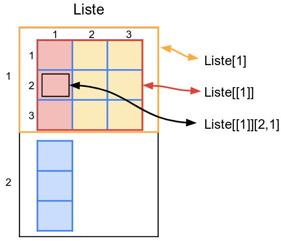

---
output:
  html_document:
    toc: true
    toc_float: true
---
<style>
  h1{
    font-size: 25px !important;
    color: #FFFFFF !important;
    border-style: solid;
    border-color: #4582EC;
    background-color: #4582EC;
    text-align: center;
  }
</style>

<style>
  h2{
    font-size: 25px !important;
    color: #4582EC !important;
    border-style: solid;
    border-color: #4582EC;
    text-align: center;
  }
</style>

<style>
  h3{
    font-size: 25px !important;
    color: #FFFFFF !important;
    border-style: solid;
    border-color: #982727;
    background-color: #982727;
    text-align: center;
  }
</style>
<style>
  h4{
    font-size: 25px !important;
    color: #FFFFFF !important;
    border-style: solid;
    border-color: #0F9D58;
    background-color: #0F9D58;
    text-align: center;
  }
</style>

<style>
  h5{
    font-size: 25px !important;
    color: #FFFFFF !important;
    border-style: solid;
    border-color: #F4B400;
    background-color: #F4B400;
    text-align: center;
  }
</style>

<h4>Synthèse</h4>

- Il existe plusieurs type de vecteur qui précisent la nature des éléments qu'ils contiennent et les opérations qu'il est possible de réaliser à partir d'eux.    

- Il y a plusieurs formats de bases de données, qui dépendent du type de vecteur qu'elles regroupent.  Les plus fréquentes sont les dataframes et les matrices.    

- La manipulation des bases est proche de celle des vecteurs:
    + On indique les indices des éléments que l'on veut sélectionner entre '[]', en séparant l'indice des lignes et l'indice des colonnes par une ','.
    + Pour les dataframes, on peut également utiliser le nom de la variable. On indique le nom de celle-ci, précédée du nom de la base en les séparant par le symbole '$'.    


****
<h1>Type de données</h1>  

Les bases de données les plus courantes peuvent être vues comme des tableaux où chaque colonne est un vecteur.  
Il existe plusieurs formats de bases de données, selon le type données que les vecteurs contiennent. 

Il existe plusieurs type de données. On parlera ici seulement des principaux: numérique, factoriel, caractères.


<br>
<h2>Définir le type d'un vecteur</h2>

Un vecteur ne contient qu'un seul type de données.

Si on définit un vecteur composé de chiffre, il sera considéré spontanément comme un vecteur numérique.   
Si on définit un vecteur composé de caractères (n'importe quel élément encadré par des " "), il sera considéré spontanément comme un vecteur caractères.    

Les vecteurs de facteurs ont une situation intermédiaire, ils associent des labels qualitatifs à des valeurs quantitatives.   
<br>
On peut:    
- convertir un vecteur numérique en vecteur factoriel, c'est à dire attribuer des labels à des chiffres.   
- convertir un vecteur de caractères en vecteur factoriel, attribuer des chiffres à des labels. 

On vérifie le type de donnée d'un vecteur en utilisant la fonction str() (structure).   

On remarque que la structure d'un facteur indique des levels (= les labels) et les chiffres qui leur sont attribués.  
R utilise un vecteur de chiffre mais il affiche les labels que vous leurs avez associés.

```{r}
Num <- c(1,2,3)
str(Num)

Cara <- c("a","b", "c") 
str(Cara)

str(c(1,2, "salut")) # on ne peut pas être numeric ET character

# les facteurs

Factor_Num <- factor(x = Num, # le vecteur de données
                     levels = c(1, 2, 3), # on identifie les niveaux du facteurs
                     labels = c("Niveau_1", "Niveau_2", "Niveau_3")) # on leur attribue des valeurs
str(Factor_Num)

Factor_Cara <- factor(x = Cara, 
                      levels = c("a", "b", "c"), 
                      labels = c("Niveau_1", "Niveau_2", "Niveau_3"))
str(Factor_Cara)

# Le résultat final est le même
# Les éléments sont identiques

Factor_Num == Factor_Cara
```

<h2>Conversions</h2>

Il est utile de savoir passer d'un type de donnée à un autre. 
<br><br>


<br><br>
On remarquera qu'il n'est pas possible de passer directement d'un vecteur de caractères à un vecteur numérique. On ne peut pas ordonner numériquement du texte sans apporter d'indications extérieures.  On peut y parvenir en utilisant une étape intermédiaire où on définit, à partir des labels provenant des facteurs, quels sont les niveaux associés à chaque éléments caractères du vecteur.  

```{r}
Num <- c(1,2,3)
Cara <- c("a","b", "c")

# de Num vers Fact
Factor_Num <- as.factor(Num) # attribution automatique des labels/niveaux
str(Factor_Num)

# de Char vers Fact
Factor_Cara <- as.factor(Cara) # attribution automatique des labels/niveaux
str(Factor_Cara)

# de Num vers Char
Conversion_en_carac <- as.character(Num)
## ces chiffres sont considérés comme du texte, il ne peuvent plus être additionnés par ex.
str(Conversion_en_carac) 

# de Char vers Num
Conversion_loupee_en_num <- as.numeric(Cara)
str(Conversion_loupee_en_num)

Conversion_reussie_en_num <- as.numeric(as.factor(Cara))
str(Conversion_reussie_en_num)
```


<h1>Matrices / Dataframes / Listes</h1>

<h2>Spécificités des formats</h2> 

Il y a 3 formats de base de données usuels:   
1.  **les matrices:** un tableau qui contient des vecteurs de même taille et de même type de données   
2.  **les dataframes:** un tableau qui contient des vecteurs de même taille mais de type qui peuvent être différent   
3.  **les listes:** un tableau qui peut contenir des objets divers, de différentes tailles et de différents types   

En pratique, de manière générale, le format matrice est utilisé pour les calculs, les dataframes pour contenir les base de données et les listes pour contenir les résultats de calculs complexes de fonctions.    

On peut convertir une base d'un format à un autre.  Si on passe d'une dataframe vers une matrice, il y aura une conversion automatique du type de données.

```{r}
Ma_matrice <- matrix(c(1,2,3, 1,2,3), ncol= 2)
Ma_matrice # toutes les colonnes sont de même taille et de même type

Ma_data_frame1 <- as.data.frame(Ma_matrice) # les matrices sont des dataframes particulières: elles n'ont qu'un type de données
Ma_data_frame1

Ma_data_frame2 <- data.frame(V1 = c(1,2,3), V2 = c(1,2,3), V3 = c("a", "b", "c")) # mais elles peuvent avoir plusieurs type de données
Ma_matrice2 <- as.matrix(Ma_data_frame2)
Ma_matrice2 # conversion en caractère de toutes les vecteurs

Ma_liste <- list(Je_mets_une_matrice = Ma_matrice, Ou_des_dataframes = Ma_data_frame2, Ou_un_vecteur = c(1,2,3))
Ma_liste # la liste contient n'importe quel élément, de n'importe quelle taille
```

<h2>Manipuler les bases</h2>

Une base est un ensemble de vecteurs arrangés en colonne. 
Sa manipulation est proche de celle des vecteurs.   

On utilise les [], juste après le nom de la base pour accéder à ses éléments.   

**On peut:**    
- **utiliser les indices:** on indique en 1er l'indice de la ligne, en 2nd l'indice de la colonne.  
- **utiliser les noms:** si les colonnes ont des noms on peut le tapper dans la zone correspondant aux colonnes (à droite de la virgule)    

Seul la manipulation pour indice est disponible pour les matrices.
Pour les dataframes on peut également accéder à une colonne en utilisant "$", entre le nom de la base et le nom de la colonne.


```{r}
Ma_data_frame <- data.frame(V1 = c(1,2,3), V2 = c(4,5,6), V3 = c("a", "b", "c"))

Ma_data_frame[3,3]
Ma_data_frame$V2
Ma_data_frame[1,]
```

Pour manipuler une liste on utilise principalement les [].    
On indique l'indice de l'élément que l'on souhaite sélectionner dans la liste, entre double [[]]. 
Puis, les indices de cet élément. 



```{r}
Ma_liste <- list(Je_mets_une_matrice = Ma_matrice, 
                 Ou_des_dataframes = Ma_data_frame2, 
                 Ou_un_vecteur = c(1,2,3))

Ma_liste[1] # on manipule la 1ère case de la liste
Ma_liste[[1]] # on descend d'un niveau, on manipule l'élément directement

# Ma_liste[1][2,1] # ne fonctionne pas, on est toujours au niveau de la liste

Ma_liste[[1]][2,1] # on est au niveau de l'élément, on peut accéder à ses indices 

Ma_liste$Je_mets_une_matrice[2,1] # équivalent à la ligne précédente
```

<h2>Fonctions utiles</h2>

**Quelques fonctions:**

```{r}
Ma_data_frame <- data.frame(V1 = c(1,2,3,4,1), 
                            V2 = c(1,2,3,4,1), 
                            V3 = c("a", "b", "c", NA,"a"))

names(Ma_data_frame) # j'affiche les noms de variables
names(Ma_data_frame) <- c("Je", "change_les_noms", "de_colonnes")
names(Ma_data_frame)

row.names(Ma_data_frame)
row.names(Ma_data_frame) <- c("Je", "change", "les_noms", "de_lignes", "comme_ca")
row.names(Ma_data_frame)

nrow(Ma_data_frame)
ncol(Ma_data_frame)

Ma_data_frame2 <- na.omit(Ma_data_frame) # je retire les lignes contenant des NA
Ma_data_frame3 <- unique(Ma_data_frame) # je retire les lignes apparaissant en double
```

<h5>Fonctions sur cette page</h5>

| Fonction             | Description     |
|----------------------|---------------------------------------------------|
| str(x) | renvoi différent éléments de la structure du vecteur x, dont le type de vecteur |
| numeric(x) ou as.numeric(x) | renvoi le vecteur x converti en vecteur de type numérique |
| character(x) ou as.character(x) | renvoi le vecteur x converti en vecteur de type caractères |
| factor(x= , levels=, labels=) | renvoi le vecteur x converti en vecteur de type factor, en attribuant des labels aux différent levels spécifiés|
| matrix(data=, ncol=) | renvoi une matrice à partir du vecteur data en les répartissant en ncol colonnes |
| data.frame(V1 =, V2, V3=) | renvoi une dataframe à partir des vecteurs V1, V2, V3, etc.. de tailles égales |
| as.matrix(x) | renvoi la base x converti au format matrice |
| as.data.frame(x) | renvoi la base x converti au format dataframe |
| list(elt1=, elt2=, elt3=) | renvoi une liste à partir des éléments elt1, elt2, elt3, etc... |
| names(x) | permet d'observer/modifier les noms de variables de la base x |
| row.names(x) | permet d'observer/modifier les noms des lignes de la base x |
| ncol(x) | renvoi le nombre de colonnes de la base x |
| nrow(x) | renvoi le nombre de lignes de la base x |
| na.omit(x) | renvoi la base x en ayant retiré toutes les lignes qui contenaient des NA|
| unique(x) | renvoi la base x en ayant retiré tous les lignes identiques |


<h3>Pour s'entraîner</h3>

Blabla