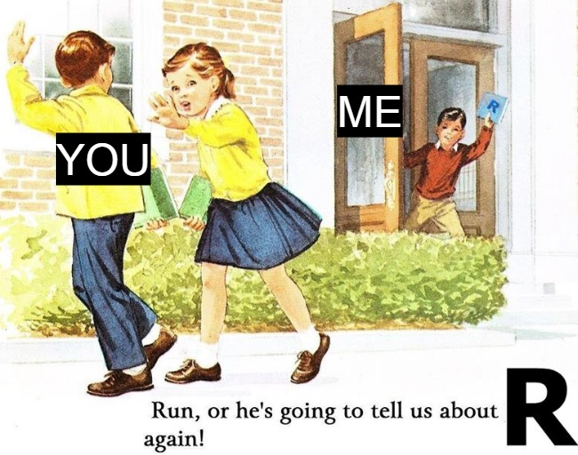

<!--    -->
<!-- 
 -->
<!--  -->
<!-- 
 -->
<!--    -->
Ce site résume les etapes de bases essentielles pour debuter dans R et effectuer ses premieres analyses. 

Pour se familiariser avec les commandes il est recommande de les recopier manuellement sous R pour les lancer, et d'experimenter en en changeant les valeurs.
