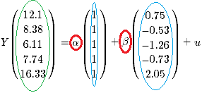
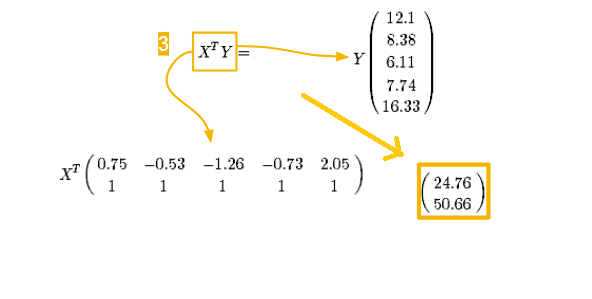
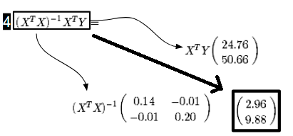
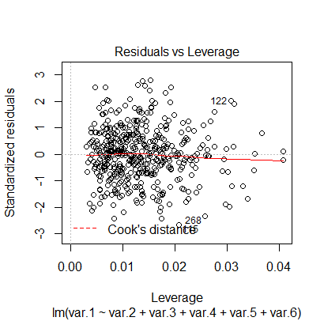

---
output:
  html_document:
    toc: true
    toc_float: true
---
<style>
hide {
  background-color: #d6d6d6;
  color: #d6d6d6;
}
hide:hover {
  background-color: white;
  color: black;
}
</style>

<style>
  h1{
    font-size: 25px !important;
    color: #FFFFFF !important;
    border-style: solid;
    border-color: #4582EC;
    background-color: #4582EC;
    text-align: center;
  }
</style>

<style>
  h2{
    font-size: 25px !important;
    color: #4582EC !important;
    border-style: solid;
    border-color: #4582EC;
    text-align: center;
  }
</style>

<style>
  h3{
    font-size: 25px !important;
    color: #FFFFFF !important;
    border-style: solid;
    border-color: #982727;
    background-color: #982727;
    text-align: center;
  }
</style>
<style>
  h4{
    font-size: 25px !important;
    color: #FFFFFF !important;
    border-style: solid;
    border-color: #0F9D58;
    background-color: #0F9D58;
    text-align: center;
  }
</style>

<style>
  h5{
    font-size: 25px !important;
    color: #FFFFFF !important;
    border-style: solid;
    border-color: #F4B400;
    background-color: #F4B400;
    text-align: center;
  }
</style>

<h4>Synthèse</h4>
- Un modèle linéaire permet de décrire la relation entre une variable expliquée quantitative et une ou plusieurs variables explicatives.       
- La fonction lm() permet de paramètrer le modèle que l'on aura réfléchis au préalable.   

<h1>Principe du test</h1>

On cherche à expliquer les valeurs d'une variable (notée **Y**) en fonction d'une combinaison d'une (ou plusieurs) autre(s) variable(s) (notée **X**).  

Quand on cherche à *comprendre* la relation entre variables on réfléchis généralement à partir d'une relation linéaire. Car elle est plus simple à interpréter. ("Pour l'augmentation d'une unité de X, de combien d'unité augmente X?").   

Cela revient à déterminer les paramètres de la droite qui passent au plus près de l'ensemble de points de coordonnées (X, Y). C'est la méthode des moindres carrés.  

**Pour cela, il faut:**  
- déterminer l'ordonné à l'origine (noté $\alpha$) et le coefficient de la pente de la droite (noté $\beta$).  
- définir un critère pour évaluer la distance entre les points et la droite. C'est la somme des distances au carré (si elles n'étaient pas mise au carré les valeurs positives et négatives s'annuleraient). 

*Sur le graphique suivant, on teste différentes droites. 
On cherche la droite des "moindre carrée", celle qui minimise les écarts entre la droite et les points (les distances en bleu). 
On cherche les paramètres (ordonné = triangle vert et pente = droite noire) qui font que la somme des distances en bleu soit la plus petite possible.*  


<br><br>

Parmi toutes les combinaisons possibles de $\alpha$ et $\beta$, une seule permet d'obtenir la valeur la plus basse des moindres carrés, à partir de notre jeu de données.   
Sur la figure suivante, si on repère la valeur la plus basse de moindre carrés, on identifie le couple $\alpha$ et $\beta$ qui permettent de déteminer la droite optimale<a name="abcde"> </a>.

```{r, echo=FALSE, warning=FALSE, message=FALSE}
library(dplyr)
set.seed(2)
Mes_X <- rnorm(10)
Mes_Y <- 50 + 3 * Mes_X + rnorm(10)

Mes_inter <- sort(rep(seq(49,51, by =0.1),10))
Mes_coeff <- sort(rep(seq(2,4, by =0.1),10))
Mes_Y <- rep(Mes_Y, 21)
Mes_X <- rep(Mes_X, 21)

Resu1 <- data.frame(Mes_inter = Mes_inter, Mes_Y = Mes_Y, Mes_X = Mes_X)
Resu2 <- data.frame(Mes_coeff = Mes_coeff, Mes_Y = Mes_Y, Mes_X = Mes_X)

Resu <- left_join(Resu1, Resu2)

Resu$Resi <- round(Resu$Mes_Y - (Resu$Mes_inter + Resu$Mes_coeff * Resu$Mes_X), 10)
Resu$Resi_car <- round(Resu$Resi*Resu$Resi,10) 
  
Resu1 <- Resu %>% group_by(Mes_coeff, Mes_inter) %>% summarise(Sum_square = round(sum(Resi_car),10))

library(plotly)

p <- plot_ly(Resu1, x = ~Mes_coeff, y = ~Mes_inter, z = ~(Sum_square),
             marker = list(color = ~Sum_square, 
                           colorscale = 'Viridis', 
                           showscale = TRUE)) %>%
  add_markers() %>%
  layout(scene = list(xaxis = list(title = 'Coefficients'),
                      yaxis = list(title = 'Intercepts'),
                      zaxis = list(title = 'Sum of square')))
p
```

<h1>Utilisation dans R</h1>

La solution directe à partir des fonctions dédiées est la méthode que l'on utilisera en pratique.   
La seconde méthode permet de voir et chercher à comprendre les calculs réalisés en arrière plan.  

<h2>Solution directe</h2>   

On définit une base de données et surtout une variable (var.1), continue, à partir des autres variables (de 2 à 6).  
On souhaite retrouver l'intercept et les coefficients qui unissent la variable var.1 aux autre variables.  
On utilise un modèle linéaire (fonction lm()).

```{r, echo=TRUE}
## ##
# Définition de la base
## ##

#Variables
var.2<- rnorm(450, 0, 12)
var.3<- rnorm(450, 20, 24)
var.4<- rnorm(450, 40, 36)
var.5<- rnorm(450, 60, 48)
var.6<- rnorm(450, 80, 60)

# Intercept
Inter <- 48

# Coefficients
A <- 3
B <- 1
C <- 0.5
D <- 0.2
E <- 0

# On construit "var.1", qui est la combinaison des variables précedente selon des coefficients déterminés
# l'équation de la droite est la suivante:
var.1 <- Inter + A*var.2 + B*var.3 + C*var.4 + D*var.5 + E*var.6 + rnorm(450, 0 , 17)  

# On crée la base
Base <- data.frame(var.1,var.2, var.3, var.4, var.5, var.6)
```


```{r, eval=FALSE, results='hide'}
## ##
# Définition du modèle
## ##

M.Lineaire.1 <- lm(formula = var.1 ~ var.2 + var.3 + var.4 + var.5 + var.6, data= Base)
summary(M.Lineaire.1) # synthèse des résultats
confint(M.Lineaire.1) # retourne les intervals de confiance
```

Les résultats de la colonne 'Estimate' correspondent à l'estimation de l'intercept et coefficients de régression. On constate qu'ils sont proches de ceux utilisés pour la construction du jeu de données.   

Les valeurs de p-values indiquent la probabilité d'observer cette estimation de coefficient si en réalité les observations étaient extraites d'une population où ce coefficient est nul (hypothèse nulle = le coefficient est nul).  
Comme précédemment, plus cette probabilité est faible, plus il est difficile de croire que l'hypothèse nulle soit valide.  

La partie 'Residuals' indique les statistiques des résidus. Les résidus représentent, pour chaque individu, l'écart entre la valeur observée de Y et celle que l'on prédit par le modèle.   
Plusieurs éléments de validités du modèle sont à déterminer à partir des résidus [(voir ici)](#habibi). 

 

<h2>Step by step</h2>


```{r}
# On sépare les X du Y
Mon_Y <- as.matrix(Base[ , 1])
Mes_x <- as.matrix(Base[ , 2:6])

# On ajoute une colonne permettant le calcul de l'ordonné à l'origine de la droite
Mes_x_et_intercept = cbind(Mes_x,1)

# On calcul les coefficients
Mes_coefficients <- solve(t(Mes_x_et_intercept) %*% Mes_x_et_intercept) %*% t(Mes_x_et_intercept) %*% Mon_Y
Mes_coefficients
```
 

<details>
<summary>Clique ICI pour le détail du calcul</summary>

On détail le cacul à partir d'un jeu de données plus petit pour simplifier le calcul numérique. 

Ce calcul comporte plusieurs étapes qui font intervenir des calculs entre matrices.  
On pourra trouver des rappels (ou non) de ces calculs [ICI](https://www.mathsisfun.com/algebra/matrix-introduction.html) et en particulier concernant [l'inversion d'une matrice](https://www.mathsisfun.com/algebra/matrix-inverse.html).   

On a généré des données à partir du code suivant:   
<br>
**X <- rnorm(5)   
Y <- 10 + 3 * X + rnorm(5, 0, 0.2)**    
<br>

On obtient 5 valeurs de X (0.75, -0.53;  -1.26, -0.73 et 2.05).   
Elles permettent de déterminer 5 valeurs de Y (12.1, 8.38, 6.11, 7.74, 16.33) à partir d'un intercept $\alpha$ (10), d'un coefficient $\beta$ (3). On observe une erreur d'estimation aléatoire, u, de distribution normale.   

On peut représenter cette équation sous la forme suivante:  


<br><br>
Généralement on dispose de X et de Y et on aimerait déterminer $\alpha$ et $\beta$ qui sont inconnus.   
On peut réécrire l'équation comme suit:    


<br>
**Détermination des coefficients:**   
On peut obtenir une estimation d'$\alpha$ et $\beta$ à partir de l'équation suivante:   
   

**Etape 1**

Cette première étape multiple la [transposé](https://www.mathsisfun.com/algebra/matrix-introduction.html) de X, avec X.   
On obtient une matrice carrée de 2 lignes 2 colonnes. 


<br>
**Etape 2** 

Au cours de la seconde étape on [inverse](https://www.mathsisfun.com/algebra/matrix-inverse.html) la matrice obtenue précédemment.  
On obtient de nouveau une matrice carré à 2 lignes et 2 colonnes. 


<br>
**Etape 3**

L'étape 3 s'intéresse au membre de droite de l'équation générale. 
On multiplie la transposée de X avec la matrice Y.  
On obtient une matrice de 1 colonne et 2 lignes. 


<br>
**Etape 4**

Cette dernière étape est le résultat générale de l'équation.    
On multiplie les matrices obtenues à l'étape **(2)** et à l'étape **(3)**.  
On obtient une matrice de 1 colonne et 2 lignes.    
    
La premère ligne donne l'estimation du coefficient $\beta$, la seconde ligne l'estimation de l'intercept $\alpha$. 


<br>
**Synthèse**  

A partir de 5 observations et de plusieurs étapes de calculs matriciels, on a déterminé des estimations de $\alpha$ et $\beta$. 
Ces estimations sont proches des valeurs utilisées pour générer les données (10 et 3, respectivement).   

</details>    

<h1>Conditions de validité</h1> 
<a name="habibi"> </a>
**En réalisant ce type de modèle on suppose que:**      
**(1)** il existe une relation linéaire entre les variables.     
**(2)** l'erreure aléatoire entre estimation et la valeur réelle de Y suit une loi normale de moyenne 0.    
**(3)** l'erreure aléatoire entre [...] est similaire quelque soient les valeurs des **Y**(s).    

Le point **(1)** se vérifie au préalable du modèle, en explorant les distribution entre Y et les variables **X**(s) que l'on souhaite utiliser dans le modèle.  
Les points **(2)** \& **(3)** sont à vérifier après avoir calculer le modèle et **avant** de se lancer dans l'interprétation des coefficients.   

Une solution courante est de vérifier graphiquement la distribution des **résidus** (la différence entre valeurs prédites et valeurs observées).

```{r, eval=FALSE}
M.Lineaire.1 <- lm(formula = var.1 ~ var.2 + var.3 + var.4 + var.5 + var.6, data= Base)
plot(M.Lineaire.1)
```

On obtient 4 graphiques de synthèse du modèle, on interprétera les 2 premiers pour analyser les résidus.  

Le premier graphique représente la valeur des résidus selon la valeur des Y prédits.    
Il informe sur **(2)** la moyenne des erreures et **(3) l'homoscédasticité** (= les erreurs que l'on commet sont régulière selon les valeurs de Y).


<br><br>
**On souhaite que:**    
- la droite rouge soit constamment proche de 0. **(2)**   
- le nuage de point est quelconque, il n'a surtout pas une forme de cône. **(3)**    

*******************************************

Le second graphique compare la distribution *observée* des résidus avec la distribution *théorique* des résidus **SI** ils suivaient une loi normale.  


<br><br>
**On souhaite que:**  
- les points soient le plus possible alignés le long de la diagonale. (on est moins sévère sur les extrémités)  
- on ne veut pas déviation trop prononcée et systèmatique de cette droite. 

***********************************

Le dernier graphique de la synthèse du modèle permet d'observer les *valeurs influentes* du modèle.   
Ce graphique permet d'identifier les individus dont les valeurs prennent beaucoup d'importance dans la détermination des coefficients du modèle.   
    
Parmi ces individus, il y a potentiellement des individus dont les valeurs sont abherrantes / fausses ou qui ont des caractéristiques qui sont réellement trop différentes du reste des individus.   
Cela peut grandement fausser les estimations du modèle car décrit alors une droite qui passe à mi chemin entre un groupe de point homogène et un point très "lointain".   Les coefficients ne décrivent alors ni le nuage de point ni le point éloigné.
        
Sur le graphique les numéros de ligne des individus influants sont affichés, cela peut être utile pour analyser en détail leurs caractéristiques.  



<h1>Relation entre variables</h1>  

Quand on fait une analyse multivariée, on considère que Y peut être expliqué par au moins deux variables. 
Il faut alors réfléchir et définir le type de relation que l'on souhaite exprimer.  
  
On se concentre sur l'association entre var.1 et var.2 en fonction des valeurs prisent par var.3.   
On compare les différentes façon de prendre en compte cette variable. 

On illustrera 3 situations (ajustement, interaction et stratification) à partir des données définies dans le code suivant.

```{r}
## ##
# La base utilisée
## ##

# 3 Variables explicatives : nos X
# var.2 et var.4 sont continues
# var.3 est une variable catégorielle
var.2 <- rnorm(450, 0, 12)
var.3 <- c(rep("A", 450/2), rep("B", 450/2))

# Intercept
Inter1 <- 48 # Intercept bas
Inter2 <- 60 # Intercept élevé

# Coefficients
Coef1 <- 1 # coefficient +
Coef2 <- -1 # coefficient -
```

<h2>L'ajustement</h2>  

On imagine que la relation entre var.1 et var.2 est identique dans les deux catégories de var.3 par contre les niveaux moyens de Y dépendent des catégories de var.3.    

On modèlise cela par des droites parallèles ($\beta$ identiques entre les groupes), dont les ordonnés à l'origine différent ($\alpha$ différents entre les groupes).
```{r}
# Ceux de la catégorie A on un intercept bas: Inter1
# Ceux de la catégorie B on un intercept élevé: Inter2
var.1 <- ifelse(var.3 == "A", Inter1 + Coef1*var.2 + rnorm(450/2, 0, 18), 
                              Inter2 + Coef1*var.2 + rnorm(450/2, 0, 18))


# Si on n'ajuste pas
# on définit un seul intercept et une seule pente
# quelque soit la valeur de var.3 on a une seule valeur d'intercept et de pente pour expliquer le lien entre Y et var.2
Resu <- lm(var.1 ~ var.2)
Resu$coefficients
```

```{r, echo = F}
# Représentation graphique
plot(var.2, var.1)
abline(Resu$coefficients[[1]], Resu$coefficients[[2]], lwd= 5, lty = "dotted")
```

```{r, echo = T}
# Si on ajuste
# on définit une seule pente 'var.2' mais 2 intercepts
# 1 = l'intercept pour le groupe A de reference '(Intercept)'
# 2 = une valeur pour ceux du groupe B 'var.3B', 
# c'est la différence entre l'intercept du groupe A et celle du groupe B
# On calcul l'intercept du groupe B en ajoutant '(Intercept)' et 'var.3B'
Resu <- lm(var.1 ~ var.2+var.3)
Resu$coefficients
```

```{r, echo = F}
# Représentation graphique
plot(var.2, var.1, col=c("blue", "tomato")[as.numeric(as.factor(var.3))], pch = 16)
abline(Resu$coefficients[[1]], Resu$coefficients[[2]], lwd= 5, lty = "dotted")
abline(Resu$coefficients[[1]]+Resu$coefficients[[3]], Resu$coefficients[[2]], lwd= 5, lty = "dotted")
```

<h2>L'intéraction</h2>

On imagine que la relation entre var.1 et var.2 dépend des catégories de var.3 aussi bien pour la pente que pour l'intercept. 

Pentes et intercepts sont différents entre les droites.

```{r}
# Ceux du groupe A on un coefficient positif Coef1
# Ceux du groupe B on un coefficient negatif Coef2
var.1 <- ifelse(var.3 == "A", Inter1 + Coef1*var.2 + rnorm(450/2, 0, 18), 
                              Inter1 + Coef2*var.2+ rnorm(450/2, 0, 18))

# / ! \ dans l'exemple les intercepts sont identiques, ils pourraient être différents


# Si on ne prend pas en compte l'intéraction
# on pense que la pente est proche de 0, ce qui est faux pour les deux groupes.
Resu <- lm(var.1 ~ var.2)
Resu$coefficients
```

```{r, echo = F}
# Représentation graphique
plot(var.2, var.1)
abline(Resu$coefficients[[1]], Resu$coefficients[[2]], lwd= 5, lty = "dotted")
```

```{r}
# Si on prend en compte l'intéraction
# on définit un coefficient pour le groupe A 'var.2'
# on définit une valeur pour le groupe B 'var.2:var.3B', que l'on ajoute au coefficient du groupe A:
# c'est la différence entre les pente du groupe A et du groupe B.
Resu <- lm(var.1 ~ var.2*var.3)
Resu$coefficients
```

```{r, echo = F}
# Représentation graphique
plot(var.2, var.1, col=c("blue", "tomato")[as.numeric(as.factor(var.3))], pch = 16)
abline(Resu$coefficients[[1]], Resu$coefficients[[2]], lwd= 5, lty = "dotted")
abline(Resu$coefficients[[1]]+Resu$coefficients[[3]], Resu$coefficients[[2]]+Resu$coefficients[[4]], lwd= 5, lty = "dotted")
```

<h2>La stratification</h2>

Si on se rend compte les relations entre Y et plusieurs variables explicative sont différentes selon le groupe d'appartenance (var.3), on peut considérer que ces deux groupes ne peuvent pas être expliquée par un seul modèle.     
On conduit alors des analyses séparemment dans chacun des groupes, c'est une **stratification**.


<h1>Comparaison de modèles</h1> 

La définition des modèles reposent sur des choix de variable.   
Ces choix sont en partie guidé par la littérature sur le sujet et le contexte de l'étude.   
Ils peuvent également être appuyés par une analyse statistique.    

On a vu [plus haut](#abcde) qu'il existe une combinaison optimale de coefficient qui permettent d'obtenir **LA** droite qui correspond aux moindre carrés.    
Cependant, toutes les variables ne participents pas également à la modèlisation de **Y**.   
Quand une variable participe très faiblement, on peut se demander si le moindre carré obtenus à partir d'un modèle sans cette variable est éloigné du moindre carré obtenu dans le modèle avec la variable.   
    
On calcul la distance entre les deux valeurs de moindre carré obtenus dans chacun des modèle.   
On les compare à partir d'un test statistique, en prenant en compte la différence du nombre de variable entre modèles.     
La p-value obtenue indique la probabilité d'observer cette différence si en réalité ces deux modèles sont équivalents.      Plus cette probabilité est faible plus on a du mal à croire que ces modèles soient similaires.    
Dans ce cas on conserve toujours le modèle présentant le plus grand nombre de variable car il présente **obligatoirement** plus d'information que le modèle plus pauvre.    
  
**Pour être valide cette comparaison doit avoir lieu sur des échantillons identiques et dans des modèles emboîtés.**  

*Dans R:*
```{r}
M.Lineaire.1 <- lm(formula = var.1 ~ var.2 + var.3 + var.4 + var.5 + var.6, data= Base)
M.Lineaire.2 <- lm(formula = var.1 ~ var.2 + var.3 + var.4, data= Base)

anova(M.Lineaire.1, M.Lineaire.2)
```

<h5>Fonctions sur cette page</h5>

| Fonction             | Description     |
|----------------------|---------------------------------------------------|
| lm(formula =, data = ) | renvoi les résultats d'un modèle linéaire |
|confint(model) | renvoi les intervals de confiance à 95% du modèle linéaire 'model' |
| anova(model1, model2)  | renvoi la comparaison des moindres carrés des models 1 & 2 |

<h3>Pour s'entraîner</h3>

A venir, un jours.