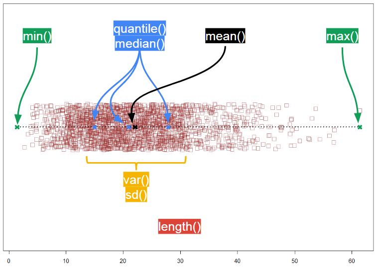
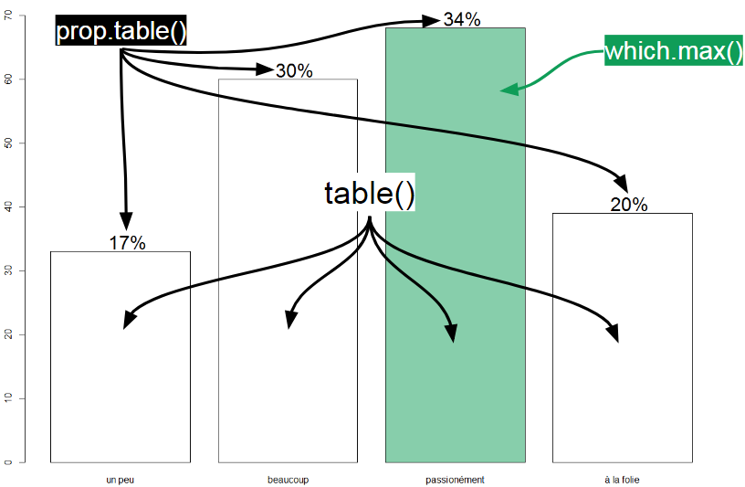

---
output:
  html_document:
    toc: true
    toc_float: true
---

<style>
  h1{
    font-size: 25px !important;
    color: #FFFFFF !important;
    border-style: solid;
    border-color: #4582EC;
    background-color: #4582EC;
    text-align: center;
  }
</style>

<style>
  h2{
    font-size: 25px !important;
    color: #4582EC !important;
    border-style: solid;
    border-color: #4582EC;
    text-align: center;
  }
</style>

<style>
  h3{
    font-size: 25px !important;
    color: #FFFFFF !important;
    border-style: solid;
    border-color: #982727;
    background-color: #982727;
    text-align: center;
  }
</style>
<style>
  h4{
    font-size: 25px !important;
    color: #FFFFFF !important;
    border-style: solid;
    border-color: #0F9D58;
    background-color: #0F9D58;
    text-align: center;
  }
</style>

<style>
  h5{
    font-size: 25px !important;
    color: #FFFFFF !important;
    border-style: solid;
    border-color: #F4B400;
    background-color: #F4B400;
    text-align: center;
  }
</style>

<h4>Synthèse</h4>

- Plusieurs fonctions permettent de décrire les statistiques des vecteurs (en uni ou bivarié).  
- Tous les indicateurs statistiques ne sont pas adapté à tous les types de données.  
- Les différentes fonctions ne gérent pas les données manquantes de la même façon. Il est souvent plus prudent d'aller vérifer ce point dans l'aide.  
- Il existe de nombreuses fonctions graphiques. La plupart des arguments sont communs à toutes ces fonctions. 
- Tous les graphiques ne sont pas adaptés pour tous les types de données.

****
<h1>Statistiques des vecteurs</h1>

On veut produire des indicateurs numériques pour comprendre les données contenues dans nos vecteurs.  
Ces indicateurs, les statistiques du vecteur, dépendent du type de données contenus.  

<h2>Données quantitatives</h2>  

**Les statistiques usuelles décrivent:**    
- *la tendance centrale:* moyenne, médiane    
- *la dispersion des données:* variance, écart-type, minimale, maximale, quantiles   
- *le lien entre variables continues:* corrélation, covariance    
- *les effectifs*   

On sera prudent sur la présence possible de **DONNEES MANQUANTES** dans le vecteur.   <br><br>
Par défaut, en présence de données manquantes, le calcul renvoit une valeur manquante. Il faut renseigner l'argument na.rm (abbréviation de na remove) pour exclure ces données du calcul.   <br><br>
Cet argument n'est pas disponible dans la fonction length(). On pourra utiliser la fonction na.omit(), vu précédemment pour calculer la taille du vecteur en excluant els données manquantes.



<br><br>    

************  

```{r}
a <- c(1:15, NA)
b <- 1:16 + rnorm(16)
categories <- c(rep("Cat.A", 8), rep("Cat.B", 8))

# univarié
mean(a)
mean(a, na.rm = TRUE)

length(a)
length(na.omit(a))

# bivarié
cor(a, b, use = "complete.obs")
cov(a, b, use = "complete.obs")

tapply(X= a, INDEX= categories, mean, na.rm=TRUE)
```

<h2>Données qualitatives</h2> 

**Les statistiques usuelles décrivent:**    
- *les effectifs et pourcentages*     
- *la catégorie majoritaire*    

Comme précédemment, la présence de **DONNEES MANQUANTES** est un combat de chaques instant. <br>  
Par défaut, R n'affiche pas les effectifs de données manquantes, ce qui peut être particulièrement préjudiciable.   
On aura recours, dans la fonction table(), à l'argument **use.Na = "always"** pour afficher ces effectifs.  



<br><br>    

************  

```{r}
b <- c("un peu", "beaucoup", "passionément", "à la folie", NA, "beaucoup")
a <- c("aime", "aime", "aime", "aime pas", "aime pas", "aime pas")

table(b)
table(b, useNA = "always")

prop.table(table(b)) # on demande les % de la table

which.max(table(b)) # on demande la catégorie avec la valeur maximale d'effectifs, dans la table

# le tableau de contingence
table(a, b)

prop.table(table(a, b)) # n / N total
prop.table(table(a, b), 1) # % ligne
prop.table(table(a, b), 2) # % colonne
```

<h1>Graphiques</h1>    

Les graphiques sont de puissants outils, ils permettent d'explorer les données, transmettre un message ou mettre en évidence un résultat.   
Il existe un grand nombre de graphique, seul les principaux seront abordés. 
Il existe également beaucoup d'arguments paramétrables, nous verrons seulement les essentiels ainsi que ceux qui omniprésents. 

On peut consulter [cette page pour plus d'exemples](https://rstudio-pubs-static.s3.amazonaws.com/7953_4e3efd5b9415444ca065b1167862c349.html).

**Dans R on peut distinguer deux type de fonctions graphique:**   
- celles de *haut niveau*, qui permettent de réaliser l'essentiel du graphique.   
- celles de *bas niveau*, qui permettent d'ajouter un élément et du détail à graphique existant.    

<h2>Fonctions de haut niveau</h2>

**Les graphiques dépendent bien entendu du type de données:**      
- Pour *données quantitatives*: stripchart (traduction?), boîtes à moustahces, histogrammes, nuage de points.     
- Pour *données qualitatives*: diagramme en batons, mosaicplot (traduction?).    
<br><br>

<br><br>
**Les arguments utiles, communs, pour contrôler:**    
- les points: cex = taille des points, [pch = motif des points](http://www.statisticstoproveanything.com/2010/09/charts-of-different-pch-values-in-r.html).  
- les traits: lwd= largeur du trait, [lty = motif du trait](http://www.statisticstoproveanything.com/2010/10/chart-of-different-lty-values-in-r.html).  
- les limites: ylim / xlim= c(valeur_basse, valeur_haute), xlim= idem.   
- les légendes: ylab / xlab = texte des axes, main = titre principale.  
- les couleurs: col = voir plus bas.

**Les arguments utiles, spécifiques à un graphique:**   
- stripchart(, method = "jitter"): permet de ne pas superposer les points.   
- hist(, freq = TRUE): permet d'afficher soit les effectifs ou les %.  
- plot(, type = "b"): relie les points entre eux.   
- barplot(table(), horiz = TRUE): la table est utilisée comme source de données, l'argument horiz permet un affichage horizontale.   
- mosaicplot(table(), shade = TRUE): la table est utilisée comme source de données, l'argument shade permet de colorer les cases en fonction des résidus de Pearson.   

  
*************** 

```{r}
a <- runif(30,0,15)
b <- 1:30
plot(x = b, y = a, 
     type = "b", 
     lwd= 2, lty = "dotted", 
     pch = 3, 
     xlab= "mes valeurs de x", ylab= "mes valeurs de y", 
     main = "Un graphique de base")

par(mfrow = c(1,2)) # affiche 1 ligne 2 colonnes de graphiques, 
#par(mfrow = c(1,1)) pour rétablir 1,1
hist(a, main = "%", freq= FALSE, col = "red")
hist(a, main = "n", freq= TRUE, col = "blue")
```

<br>  

<h2>Fonctions de bas niveau</h2>

Ces fonctions s'exécutent après avoir définit un graphique. 
Elles permettent de rajouter des éléments ponctuels pour compléter le graphique.  
On ne rentrera pas dans le détail de leur utilisation.  

**On retrouve des fonctions qui ajoutent:**   
- du texte: legend(), text().   
- des traits: abline(), lines(), segments().    
- des points: points().   
<br>    
    
********
```{r}
a <- runif(15,0,15)
b <- 1:15
a1 <- factor(x = round(runif(15,0,1)), c(0, 1), c("vert", "rouge"))

plot(x = b, y = a, 
     pch = 16, 
     xlab= "mes valeurs de x", ylab= "mes valeurs de y", 
     main = "Les couleurs en fonction \n d'une variable",
     col = c("#0F9D58", "tomato")[as.factor(a1)])

# un guide des couleurs
legend( "bottomright", legend = levels(a1), fill = c("#0F9D58", "tomato"))

# un texte inutile
text("Je peux rajouter des lignes \n des points \n du texte", x = 8, y = 10)

# droite et point
abline(2, 1, lty = "dotted")
points(x = 3, y = 3, pch = 3, lwd= 3)
```

<h2>Gestion des couleurs</h2>   

En tappant colors() dans la console on affiche la liste des couleurs disponibles dans R.  
Ce sont ces caractères qu'il faut écrire dans l'argument 'col' des différents graphiques. 
On peut également utiliser leur indice de position si on le connaît.  

On peut également utiliser directement les codes couleurs ([rgb](https://rgbcolorcode.com/) ou [hexadecimal](https://www.color-hex.com/)) pour définir soit même la couleur que l'on souhaite.
  
**Pour attribuer des couleurs selon les niveaux d'une variable catégorielle:**    
1. définir une liste de couleur dans un vecteur.   
2. dans ce vecteur, on utilise le level de la variable catégorielle pour sélectionner la couleur.    

*************

```{r}
a <- runif(15,0,15)
b <- 1:15
a1 <- factor(x = round(runif(15,1,3)), c(1, 2, 3), c("petit", "moyen", "grand"))
str(a1)

liste_couleur <- c("tomato", # couleur de base R
                   rgb(0.5, 0.5, 0.4), # code rgb
                   "#1d69d2") # code hexadecimal

plot(x = b, y = a, 
     pch = 16, 
     main = "Les couleurs en fonction \n d'une variable",
     col = liste_couleur[a1]) # selection de la couleur, selon la catégorie
```


<h5>Les fonctions sur cette page</h5>

| Fonction             | Description     |
|----------------------|---------------------------------------------------|
| min(x = , na.rm = ) | renvoi la valeur minimale du vecteur x |
| max(x = , na.rm = ) | renvoi la valeur maximale du vecteur x |
| mean(x = , na.rm = ) | renvoi la moyenne ... |
| median(x = , na.rm = ) | renvoi la médiane ... |
| quantile(x = , na.rm = ) | renvoi les quartiles ... |
| var(x = , na.rm = ) | renvoi la variance ... |
| sd(x = , na.rm = ) | renvoi l'écart-type ... |
| length(x = ) | renvoi la longueur ... |
| cor(x = , y=, use = ) | renvoi la corrélation entre le vecteur x et le vecteur y |
| covar(x = , y=, use = ) | renvoi la covariance entre le vecteur x et le vecteur y |
| tapply(X=, INDEX= , function) | renvoi la valeur calculée par function, du vecteur numérique x, en fonction des catégories définies par INDEX |
| table(x = ,y=, use.na = "always") | renvoi le tableau de contingence des vecteurs x et y |
| prop.table(z,1/2) | renvoi les % lignes ou colonnes du tableau de contingence z |
| which.max(x) | renvoi l'indice de position et la valeur de l'élément x ayant la valeur maximale |
| stripchart(, method = “jitter”) | graphique |
| boxplot() | graphique |
| hist(, freq = TRUE) | graphique |
| plot(, type =) | graphique |
| barplot(, horiz =) | graphique |
| mosaicplot(, shade =) | graphique |
| legend(,legend=, fill=) | rajoute une légende au graphique actif |
| text() | rajoute du texte au graphique actif |
| abline() | rajoute une droit au graphique actif |
| points() | rajoute un point au graphique actif |


<h3>Pour s'entraîner</h3>

A venir.